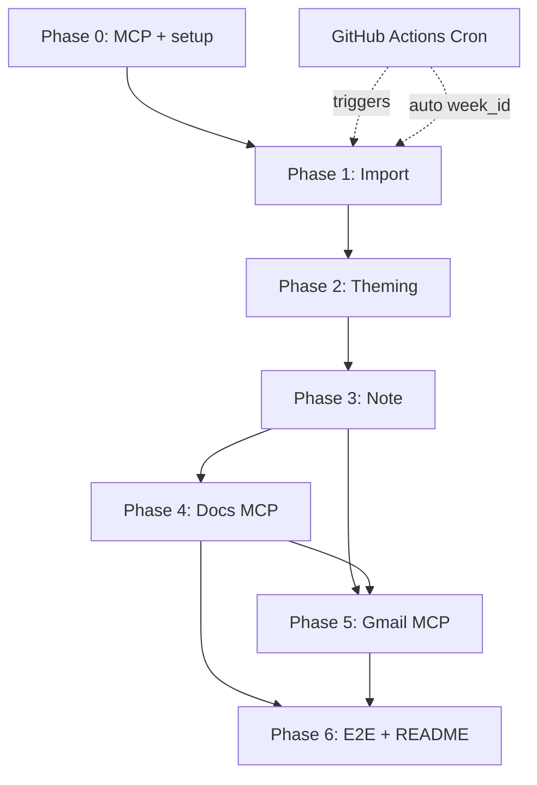

# Phase-Wise Implementation Plan

> **Reference:** [Problem Statement](./problemstatement.md) · [Architecture](./architecture.md) · [Decisions](./decision.md)  
> **Goal:** Build an AI agent workflow that ingests app reviews, generates a weekly pulse, and publishes via **Google Docs + Gmail MCP**—without direct Google APIs in the project.

Each phase has an **evaluation checklist** in `docs/phases/<phase>/eval.md`. **Do not start the next phase until exit criteria pass.**

This plan describes **what to do and how to verify it**—not implementation code. Execution is via **Cursor agent + MCP tools + saved artifacts**.

---

## How to use this document

| Section | Purpose |
|---------|---------|
| **Objectives** | What “done” means |
| **Prerequisites** | Required before starting |
| **Work breakdown** | Ordered activities with time estimates |
| **Outputs** | Artifacts to produce |
| **Agent guidance** | What to ask the Cursor agent |
| **Verification** | How to confirm success |
| **Risks** | Common failures and mitigations |
| **Exit gate** | Link to phase `eval.md` |

---

## Timeline overview

| Phase | Name | Est. effort | Blocking output |
|-------|------|-------------|-----------------|
| **0** | Foundation & MCP setup | 0.5–1 day | MCP verified; config templates |
| **1** | Review import | 1–1.5 days | Normalized, redacted CSV |
| **2** | Theme grouping | 1–1.5 days | Themed reviews + legend |
| **3** | Weekly note (LLM) | 1–1.5 days | Note ≤250 words |
| **4** | Google Docs (MCP) | 0.5–1 day | Live Doc link |
| **5** | Gmail draft (MCP) | 0.5 day | Draft in Gmail |
| **6** | E2E & deliverables | 0.5–1 day | README + demo |

**Total:** ~5–7 days for a complete, demo-ready submission.

---

# Phase 0 — Foundation & MCP Setup

## Objectives

1. Select and configure a **Google Workspace MCP server** (Docs + Gmail draft).
2. Establish folder layout, run manifest, and theme legend templates.
3. Prove MCP works with smoke tests (Doc + draft, no send).
4. Record decisions in [decision.md](./decision.md).

## Prerequisites

- Google account with Docs and Gmail
- Cursor (recommended) or another MCP client
- Runtime requirements per chosen MCP server docs
- **LIP (4) product** name decided

## Work breakdown

### 0.1 — Choose MCP server (30–60 min)

| Task | Detail |
|------|--------|
| Compare options | Google Workspace MCP or team-approved alternative |
| Verify capabilities | Create doc, write text, create Gmail **draft** (not send) |
| Document tools | Fill ADR-003 in [decision.md](./decision.md): tool names, env vars, scopes |

**Done when:** Tool mapping table is complete and server installs successfully.

### 0.2 — Configure MCP in Cursor (30–60 min)

| Task | Detail |
|------|--------|
| Google Cloud project | Enable Docs + Gmail APIs (for MCP server process, not your repo) |
| OAuth | Consent screen, test users, client credentials |
| MCP config | Register server in Cursor per server documentation |
| Secrets | Store credentials in environment only—never commit |
| Reload | Restart Cursor; confirm server shows as connected |

### 0.3 — Smoke tests (30 min)

Ask the agent (with MCP enabled):

1. Create a Google Doc titled **“MCP Smoke Test — delete me”** with a short body.
2. Create a Gmail **draft** to your email with subject **“MCP Smoke Test”**.
3. Confirm both exist. **Do not send** the email.

| Check | Expected |
|-------|----------|
| Doc in Drive | Correct title and body |
| Draft in Gmail | Visible under Drafts |
| Boundary | No Google API keys or SDK setup in this repo |

### 0.4 — Project scaffold (1–2 hours)

| Item | Purpose |
|------|---------|
| `config/run_manifest` | Product, week_id, date range, CSV paths, email, doc title |
| `config/theme_legend` | 4–5 starter themes for your product |
| `reviews_raw/` | Incoming store exports |
| `data/runs/` | Per-week artifact folders |
| `prompts/` | Versioned theming and note prompts |
| `docs/phases/` | eval.md per phase (already present) |
| `.gitignore` | Exclude `.env`, raw runs, sensitive CSVs |

Use [architecture §9](./architecture.md#9-configuration) for manifest and legend field lists.

### 0.5 — Decisions (15 min)

Update [decision.md](./decision.md):

- **ADR-002:** Primary execution mode (Cursor agent vs manual runbook)
- **ADR-003:** MCP server + tool names
- **ADR-005:** LLM provider (Groq) and model (Llama-3.3-70b-versatile) for Phases 2–3

## Outputs

| Artifact | Location |
|----------|----------|
| MCP configuration | Cursor MCP settings (documented in README) |
| Run manifest template | `config/` |
| Theme legend template | `config/` |
| Updated ADRs | `docs/decision.md` |

## Verification

| Check | Method |
|-------|--------|
| MCP Doc + draft | Manual smoke test |
| Config templates exist | Folder review |
| ADR-003 filled | Read decision log |

## Risks & mitigations

| Risk | Mitigation |
|------|------------|
| OAuth fails | Follow server redirect URL docs; add test user |
| Tool names differ | Inspect MCP tool list in Cursor; update ADR-003 |
| Missing Gmail scope | Ensure compose/draft scope on MCP server |

## Exit gate

→ [phases/phase-0-foundation/eval.md](./phases/phase-0-foundation/eval.md)

---

# Phase 1 — Review Import & Normalization

## Objectives

1. Ingest **App Store** and **Play Store** public CSV exports.
2. Merge, dedupe, and filter to **8–12 weeks** per manifest.
3. Redact PII from review text.
4. Produce auditable import report.

## Prerequisites

- Phase 0 complete
- CSV exports in `reviews_raw/`
- `run_manifest` updated with paths and date range

## Work breakdown

### 1.1 — Understand your exports (30 min)

| Task | Detail |
|------|--------|
| Inspect headers | List column names for each store’s export |
| Map to canonical | Date, rating, title, text, id (see [architecture §5 Phase 1](./architecture.md#phase-1--import--normalization)) |
| Note gaps | Play Store may lack title; handle empty fields |

### 1.2 — Normalize and merge (2–3 hours)

| Step | Action |
|------|--------|
| Parse each CSV | Map columns to canonical schema |
| Validate ratings | Keep 1–5 only; drop invalid |
| Parse dates | Support common export formats |
| Merge | Combine App Store + Play Store |
| Dedupe | By native review id, or hash of store + date + rating + text snippet |
| Filter content | Keep >6 words, no emojis, English only |
| On collision | Keep row with longer text |

### 1.3 — Apply date window (30 min)

| Step | Action |
|------|--------|
| Read manifest | `start` and `end` dates (inclusive) |
| Filter | Remove reviews outside 8–12 week window |
| Report | Count rows before / in / after window |

### 1.4 — PII redaction (1 hour)

| Pattern | Action |
|---------|--------|
| Email addresses | Replace with `[REDACTED]` |
| Phone numbers | Replace with `[REDACTED]` |
| @handles | Replace with `[REDACTED]` |
| Long numeric IDs | Replace with `[REDACTED]` |

Apply to **title** and **text**. Log counts in import report.

### 1.5 — Quality checks (30 min)

| Check | Pass criteria |
|-------|---------------|
| Row count | At least 1 review after filter (or fail with clear reason) |
| Required fields | Every row has store, rating, text, date |
| Empty text | Dropped; counted in report |
| Spot sample | 20 random rows—no obvious PII left |

### 1.6 — Save artifacts (15 min)

| Artifact | Content |
|----------|---------|
| `reviews_normalized.csv` | Final table |
| `import_report.json` | Status, row counts, date range, redactions, errors |
| Update `run_state.json` | Phase 1 = complete |

## Agent guidance

Ask the agent to:

- Read both CSVs and manifest.
- Produce normalized CSV and import report under `data/runs/{week_id}/`.
- Redact PII and fail clearly if zero rows remain.
- Do not start Phase 2 until import report shows success.

## Outputs

| File | Purpose |
|------|---------|
| `data/runs/{week_id}/reviews_normalized.csv` | Phase 2 input |
| `data/runs/{week_id}/import_report.json` | Audit + gate |

## Verification

| Check | Reference |
|-------|-----------|
| Schema | [architecture §6.2](./architecture.md#62-reviews_normalizedcsv) |
| eval.md | [phase-1-import/eval.md](./phases/phase-1-import/eval.md) |

## Risks & mitigations

| Risk | Mitigation |
|------|------------|
| Column names changed | Extend mapping table in README |
| All rows filtered out | Widen date range |
| Very large file | Process in chunks; optional dev sampling |

## Exit gate

→ [phases/phase-1-import/eval.md](./phases/phase-1-import/eval.md)

---

# Phase 2 — Theme Grouping (≤5 Themes)

## Objectives

1. Assign **every** review to exactly **one** theme.
2. Use **at most 5** themes aligned to your LIP (4) product.
3. Produce legend + per-theme statistics for Phase 3.

## Prerequisites

- Phase 1 exit criteria met
- Theme legend drafted (4–5 themes)
- LLM access configured (Groq API, ADR-005)

## Work breakdown

### 2.1 — Finalize theme legend (1 hour)

| Task | Detail |
|------|--------|
| Theme ids | Stable slugs: `onboarding`, `payments`, etc. |
| Names & descriptions | PM-readable; match your product |
| Keywords | 5–10 example terms per theme for classifier |
| Cap | Never more than **5** themes |

Store as `config/theme_legend` and copy to run folder as `theme_legend.json`.

### 2.2 — Design classification approach (30 min)

| Approach | When to use | Batch size | Inter-call delay |
|----------|-------------|------------|------------------|
| **Dual-model (recommended)** — 8B for Phase 2, 70B for Phase 3 | Default; maximum rate-limit headroom | 25 | 18s (8B TPM: 6K/min) |
| **Single-model (fallback)** — 70B for both phases | 8B model unavailable | 25 | 10s (70B TPM: 12K/min) |
| **Embedding cluster + LLM naming** | Very high volume; more setup | N/A | N/A |

**Key constraints for 70B model (`llama-3.3-70b-versatile`):**

| Limit | Cap | Impact on Phase 2 |
|-------|-----|-------------------|
| RPM | 30 | 40 batches with 10s delay → ≤6 calls/min ✅ |
| RPD | 1,000 | 40 batches ✅ |
| TPM | 12,000 | ~2K tokens/call with 10s delay → ≤6 calls/min ✅ |
| TPD | 100,000 | 40 batches × ~2K = ~80K + Phase 3 ~10K = ~90K ⚠️ tight |

If using single-model mode, truncate review text to **first 40 words** before classification to keep per-batch tokens under 2,000. This is essential to stay within the 100K TPD limit when combining Phase 2 and Phase 3 on the same model.

Record choice in ADR-004.

### 2.3 — Run classification (2–3 hours)

| Step | Action |
|------|--------|
| Preprocess | Sort by date, apply review_limit (1,000), dedupe, truncate text to first 40 words (critical for 70B single-model) |
| Batch reviews | Groups of 25 with legend in prompt |
| Classify with pacing | **Dual-model:** 18s delay between calls (8B TPM safe); **Single-model:** 10s delay (70B TPM safe) |
| Assign | Each review gets one `theme_id` + optional confidence |
| Handle unknowns | Map to nearest theme or documented `general` bucket |
| Cap themes | If LLM invents a 6th theme, merge into closest of five |
| Monitor tokens | Log cumulative TPD; if single-model and approaching 80K, pause before Phase 3 |
| Handle failures | On 429 error: backoff 5s → 15s → 45s, max 3 retries; skip batch after 3 failures |

**Estimated runtime:**
- Dual-model (8B): 40 batches × 18s = ~12 minutes
- Single-model (70B): 40 batches × 10s = ~7 minutes

Use versioned prompt: `prompts/theme_grouping_v1`.

### 2.4 — Compute theme analytics (1 hour)

Per theme, calculate:

| Metric | Use in Phase 3 |
|--------|----------------|
| Review count | Volume signal |
| % of total | Share of voice |
| Average rating | Sentiment |
| % ratings ≤2★ | Pain signal |
| **Theme score** | Rank top 3 (see [architecture](./architecture.md#phase-2--theme-grouping)) |

Save `theming_report.json` with prompt version and batch count.

### 2.5 — Quality review (30 min)

| Check | Target |
|-------|--------|
| Coverage | Every review has a theme |
| Theme count | ≤ 5 in legend |
| Spot-check | 15 reviews → ≥12 correct assignments |
| Balance | Flag if one theme >80% (note in report, still valid) |

## Agent guidance

Ask the agent to:

- Load normalized CSV and theme legend.
- Truncate review text to first 40 words for classification (saves tokens, critical for single-model mode).
- Classify all reviews into ≤5 themes using batches of 25.
- Apply inter-call pacing: 18s delay (dual-model 8B) or 10s delay (single-model 70B).
- Monitor cumulative token usage; abort if approaching 90K TPD in single-model mode.
- Write `theme_legend.json`, `themed_reviews.json`, `theming_report.json`.
- Merge excess themes if needed and log mappings.

## Outputs

| File | Purpose |
|------|---------|
| `theme_legend.json` | README + note context |
| `themed_reviews.json` | Per-review labels |
| `theming_report.json` | Stats for ranking |

## Verification

→ [phases/phase-2-theming/eval.md](./phases/phase-2-theming/eval.md)

## Risks & mitigations

| Risk | Mitigation |
|------|------------|
| Inconsistent labels week to week | Fixed legend ids |
| LLM cost/time / rate limits | Batch size 25; 10–18s inter-call delay; truncate reviews to 40 words |
| 70B TPD exhaustion (single-model) | Monitor cumulative tokens; warn at 80K; abort at 90K |
| 429 rate-limit errors | Exponential backoff: 5s → 15s → 45s; skip batch after 3 retries |
| Non-English text | Classify anyway; no translation in v1 |

## Exit gate

→ [phases/phase-2-theming/eval.md](./phases/phase-2-theming/eval.md)

---

# Phase 3 — Weekly Note Generation (LLM)

## Objectives

1. Select **top 3 themes** by theme score.
2. Include **3 real quotes** and **3 action ideas**.
3. Keep total note **≤250 words**, executive tone, **no PII**.

## Prerequisites

- Phase 2 exit criteria met
- `theming_report.json` available

## Work breakdown

### 3.1 — Rank themes (30 min)

| Step | Action |
|------|--------|
| Sort | By theme score from Phase 2 |
| Select | Top 3 for the note |
| Document | Which themes were excluded and why (in note report) |

### 3.2 — Select quote candidates (1 hour)

| Rule | Detail |
|------|--------|
| Pool | Top painful reviews per theme (prefer 1–3★ for issues) |
| Length | Roughly 20–200 characters |
| Fidelity | Must exist verbatim in source (minor ellipsis ok) |
| PII | Discard any candidate that fails scan |
| Coverage | Prefer quotes from 3 different themes |

Optional: save candidate list for evaluator audit.

### 3.3 — Draft note with LLM (1–2 hours)

| Input to LLM | Purpose |
|--------------|---------|
| Top 3 themes + stats | Context |
| Quote candidates | Faithful selection |
| Theme legend | Consistent naming |
| Constraints | 3+3+3, ≤250 words, no PII, executive tone |

Use versioned prompt: `prompts/weekly_note_v1`.

**Required output sections:**

1. Top themes (3) with one-line summaries  
2. What users are saying (3 quotes)  
3. Recommended actions (3 items tied to themes)

### 3.4 — Validate and refine (30–60 min)

| Validation | Action if fail |
|------------|----------------|
| Word count >250 | Regenerate with “shorten” instruction (max 2 retries) |
| Missing section | Regenerate with checklist |
| PII detected | Remove quote; pick alternate |
| Quote not in source | Reject; pick different quote |

### 3.5 — Produce final artifacts (30 min)

| Artifact | Format |
|----------|--------|
| Structured note | `weekly_note.json` — all fields for audit |
| Readable note | `weekly_note.md` — matches challenge deliverable |
| Report | `note_report.json` — word count, prompt version, PII scan, retries |

## Agent guidance

Ask the agent to:

- Use theming report to pick top 3 themes.
- Select 3 faithful, PII-safe quotes with source review ids.
- Write note ≤250 words with 3 action ideas.
- Save JSON + MD; run PII scan before marking success.

## Outputs

| File | Purpose |
|------|---------|
| `weekly_note.json` | Structured deliverable |
| `weekly_note.md` | Human-readable / fallback |
| `note_report.json` | Gate + audit |

## Verification

| Check | Criteria |
|-------|----------|
| Structure | 3 themes, 3 quotes, 3 actions |
| Length | ≤250 words |
| PM review | “Would I send to leadership?” → Yes |
| eval.md | [phase-3-note-generation/eval.md](./phases/phase-3-note-generation/eval.md) |

## Risks & mitigations

| Risk | Mitigation |
|------|------------|
| Hallucinated quotes | Require `source_review_id` in structured output |
| Generic actions | Prompt: tie each action to a specific theme pain |
| Over word limit | Retry loop + manual trim as last resort |

## Exit gate

→ [phases/phase-3-note-generation/eval.md](./phases/phase-3-note-generation/eval.md)

---

# Phase 4 — Publish to Google Docs (MCP)

## Objectives

1. Publish `weekly_note.md` to Google Docs **using MCP only**.
2. Record **doc URL** for deliverables and email.
3. Support **update** on re-run (ADR-007).

## Prerequisites

- Phase 0 MCP smoke tests passed
- Phase 3 exit criteria met
- MCP server running in Cursor

## Work breakdown

### 4.1 — Prepare publish package (15 min)

| Item | Source |
|------|--------|
| Title | Manifest template: `{product} — Weekly Review Pulse — {week_id}` |
| Body | Full `weekly_note.md` |
| PII scan | Final pass—no publish if PII found |

### 4.2 — Execute MCP publish (30–60 min)

| Step | MCP operation |
|------|-----------------|
| 1 | If `publish_result.json` exists for this week → **update** same doc |
| 2 | Else → **create** new document |
| 3 | Write full note body into document |
| 4 | Confirm content length matches source |
| 5 | Save `doc_id`, `doc_url`, tools used, timestamp |

**Critical:** Only MCP tools—no direct Google API setup in this project.

### 4.3 — Verify (15 min)

| Check | Method |
|-------|--------|
| Doc opens | Click link |
| Content | Matches approved note |
| Title | Correct product and week |
| Audit | `docs_report.json` status = success |

## Agent guidance

Tell the agent:

- Read `weekly_note.md` for `{week_id}`.
- Use **MCP tools only** to create or update the Google Doc.
- Save `publish_result.json` and `docs_report.json`.
- Stop with failed status if any MCP call fails.

## Outputs

| File | Purpose |
|------|---------|
| `publish_result.json` | Doc link for README / email |
| `docs_report.json` | MCP audit trail |

## Verification

→ [phases/phase-4-docs-mcp/eval.md](./phases/phase-4-docs-mcp/eval.md)

## Risks & mitigations

| Risk | Mitigation |
|------|------------|
| MCP offline | Keep markdown; paste manually for demo |
| Formatting loss | Use plain headings/bullets acceptable for v1 |
| Wrong Google account | Verify Doc under intended account |

## Exit gate

→ [phases/phase-4-docs-mcp/eval.md](./phases/phase-4-docs-mcp/eval.md)

---

# Phase 5 — Gmail Draft (MCP)

## Objectives

1. Create Gmail **draft** with note + Doc link.
2. Send to self/alias from manifest.
3. **Do not send**—human reviews in Gmail.

## Prerequisites

- Phase 0 MCP passed
- Phase 3 complete
- Phase 4 recommended (for doc link)

## Work breakdown

### 5.1 — Compose email content (15 min)

| Field | Template |
|-------|----------|
| To | From manifest |
| Subject | `[Weekly Pulse] {product} — {week_id}` |
| Body | Brief intro + full note + “Full doc: {url}” + draft disclaimer |

### 5.2 — Create draft via MCP (15–30 min)

| Step | Action |
|------|--------|
| 1 | Call MCP create-draft tool only |
| 2 | Confirm draft in Gmail → Drafts folder |
| 3 | Confirm **not** in Sent |
| 4 | Save `email_draft_result.json` + `gmail_report.json` |

### 5.3 — Capture deliverable evidence (15 min)

- Screenshot of draft (To, Subject, body excerpt), or  
- Exported draft text for repo / submission

## Agent guidance

Tell the agent:

- Use note + `doc_url` from Phase 4.
- MCP create draft only—**never send**.
- Save draft result JSON with draft id.

## Outputs

| File | Purpose |
|------|---------|
| `email_draft_result.json` | Proof of draft |
| `gmail_report.json` | MCP audit |
| Screenshot | Challenge deliverable |

## Verification

→ [phases/phase-5-gmail-mcp/eval.md](./phases/phase-5-gmail-mcp/eval.md)

## Risks & mitigations

| Risk | Mitigation |
|------|------------|
| Accidental send | Never invoke send tool; ADR-006 |
| Body too long | Plain text; no attachments in v1 |

## Exit gate

→ [phases/phase-5-gmail-mcp/eval.md](./phases/phase-5-gmail-mcp/eval.md)

---

# Phase 6 — End-to-End Orchestration & Deliverables

## Objectives

1. Document full weekly workflow from CSV → Doc → draft.
2. Complete all LIP deliverables.
3. Record ≤3 min demo.

## Prerequisites

- Phases 0–5 evals passed (or documented exceptions)

## Work breakdown

### 6.1 — Document weekly runbook (1–2 hours)

README must include:

| Section | Content |
|---------|---------|
| Overview | What the agent does |
| Prerequisites | Google account, MCP, LLM, exports |
| MCP setup | Server name, env var **names** (not values), Cursor steps |
| Weekly re-run | Numbered steps: export → manifest → phases 1–5 |
| Theme legend | Table from `theme_legend.json` |
| Latest outputs | Links to sample Doc, draft screenshot |
| Architecture | Link to `docs/architecture.md` |

### 6.2 — Run full E2E once (1–2 hours)

| Step | Phase |
|------|-------|
| 1 | Drop new CSVs; set `week_id` and dates |
| 2 | Phase 1 → verify import report |
| 3 | Phase 2 → verify theming report |
| 4 | Phase 3 → verify note word count |
| 5 | Phase 4 → verify Doc link |
| 6 | Phase 5 → verify draft |
| 7 | Archive `data/runs/{week_id}/` |

### 6.3 — Prepare deliverable bundle (30–60 min)

| Deliverable | Action |
|-------------|--------|
| Prototype / demo | Record ≤3 min video OR live repo walkthrough |
| Weekly note | Doc link + `weekly_note.md` in repo |
| Email draft | Screenshot in `docs/deliverables/` |
| Reviews CSV | Redacted sample in `reviews_raw/sample/` |
| README | Complete per 6.1 |

### 6.4 — Demo script (practice 2–3 takes)

| Time | Content |
|------|---------|
| 0:00–0:20 | Problem + your product |
| 0:20–0:50 | Show CSVs + manifest |
| 0:50–1:40 | Walk Phases 1–3 artifacts |
| 1:40–2:20 | Open Google Doc (MCP) |
| 2:20–2:50 | Show Gmail draft |
| 2:50–3:00 | README re-run steps |

### 6.5 — Final eval sweep (30 min)

Sign off every `docs/phases/*/eval.md` checklist.

## Agent guidance (master)

Use as Cursor system context:

- Run phases 0→5 in order; respect gates.
- Phases 1–3: artifacts under `data/runs/{week_id}/` only.
- Phases 4–5: MCP for Google Docs and Gmail only.
- Constraints: ≤5 themes, ≤250 words, 3+3+3, no PII, draft-only email.
- On failure: mark phase report failed and stop.

## Weekly operator checklist

1. Export App Store + Play CSVs → `reviews_raw/`
2. Update manifest: `week_id`, date range, paths
3. Run Phase 1 with agent → verify import report
4. Run Phase 2 → verify ≤5 themes
5. Run Phase 3 → verify word count and quotes
6. Run Phase 4 (MCP) → verify Doc
7. Run Phase 5 (MCP) → verify draft
8. Optionally send email manually from Gmail
9. Archive run folder

## Outputs

| Artifact | Location |
|----------|----------|
| README | Repository root |
| Demo | Link or `docs/deliverables/` |
| Sample run | `data/runs/{example_week_id}/` (redacted) |

## Verification

→ [phases/phase-6-orchestration/eval.md](./phases/phase-6-orchestration/eval.md)

## Risks & mitigations

| Risk | Mitigation |
|------|------------|
| Live demo fails | Pre-record video; keep artifacts |
| Evaluator lacks MCP | README + screenshots + MD fallback |

## Exit gate

→ [phases/phase-6-orchestration/eval.md](./phases/phase-6-orchestration/eval.md)

---

# CI/CD — GitHub Actions Automation

> **This is an additive automation layer.** It does not modify any phase logic—it orchestrates the same CLI commands that you run locally, on a weekly cron schedule.

## Objectives

1. Automate the full pipeline (Phases 1→5) to run **every Monday at 09:00 UTC**.
2. Support **manual execution** via `workflow_dispatch` with override inputs.
3. Preserve all artifacts for 30 days and generate a GitHub Job Summary.
4. Notify on failure by auto-creating a GitHub Issue.
5. Retry transient failures automatically (up to 3 attempts per phase).
6. Generate consolidated `weekly_summary.json` and `email_draft.md` artifacts.

## Prerequisites

- Repository pushed to GitHub
- GitHub Secrets configured (see below)
- MCP server deployed and accessible (Railway URL)

## Work breakdown

### CI.1 — Configure GitHub Secrets (15 min)

Go to **Settings → Secrets and variables → Actions** and add:

| Secret | Value | Required by | Notes |
|--------|-------|-------------|-------|
| `GROQ_API_KEY` | Your Groq API key | Phases 2, 3 | **Required** — workflow fails fast if absent |
| `GOOGLE_DOC_ID` | Google Doc ID (without `/edit?...`) | Phase 4 | Optional if `skip_mcp=true` |
| `EMAIL_TO` | Recipient email address | Phase 5 | Optional if `skip_mcp=true` |
| `MCP_SERVER_URL` | MCP server URL (optional — defaults to Railway) | Phases 4, 5 | Has a safe default |

### CI.2 — Workflow file

| File | Purpose |
|------|---------|
| `.github/workflows/weekly_review_pulse.yml` | Cron + dispatch workflow with retry handling |
| `scripts/update_manifest.py` | Auto-updates manifest with computed week_id and dates |

### CI.3 — How to trigger manually from GitHub Actions

1. Go to your repo on GitHub.
2. Click the **Actions** tab.
3. Select **Weekly Review Pulse** from the left sidebar.
4. Click **Run workflow** (top-right dropdown button).
5. Fill in optional inputs:
   - **week_id** — leave empty for auto-detect, or enter e.g. `2026-W22`
   - **through_phase** — `5` runs everything; `3` stops after note generation; `1` runs import only
   - **skip_mcp** — check to skip Phases 4–5 (useful for dry runs without Google credentials)
6. Click **Run workflow**.

The workflow will appear in the list within a few seconds. Click it to watch live logs.

### CI.4 — Retry handling

Each phase uses `nick-fields/retry@v3`:

| Parameter | Value |
|-----------|-------|
| Max attempts | 3 |
| Retry wait | 30 seconds |
| Phase 1 timeout | 10 minutes |
| Phase 2 timeout | 20 minutes (LLM-heavy) |
| Phase 3–5 timeout | 10 minutes each |
| Job timeout | 45 minutes total |

Retries handle: Groq 429 rate-limit errors, MCP server hiccups, transient network failures.

### CI.5 — Generated artifacts

Beyond the standard phase outputs, the workflow generates two additional artifacts:

| Artifact | Content |
|----------|---------|
| `weekly_summary.json` | Consolidated run summary: phase statuses, import counts, note word count, doc URL, draft ID |
| `email_draft.md` | Human-readable email preview combining the note body, doc link, and draft metadata |

### CI.6 — Verification

| Check | Method |
|-------|--------|
| Workflow runs on schedule | Check Actions tab on Monday |
| Artifacts uploaded | Download `weekly-pulse-{week_id}` bundle from run summary |
| Job summary | Visible on the workflow run page (phase table + doc link) |
| Failure notification | Check GitHub Issues on failure |
| Manual dispatch works | Trigger from Actions UI |
| Retry works | Temporarily break a phase; confirm 3 attempts before failure |

### CI.7 — Zero-code weekly operation

The workflow processes a new week's reviews **without any code changes**:

1. `update_manifest.py` auto-computes `week_id` and 12-week date window from the current date.
2. `fetch_groww_playstore.py` refreshes the Play Store CSV automatically (`continue-on-error`).
3. All phase CLIs accept `--week-id` and `--manifest` — no hardcoded values.
4. Artifact folders are namespaced by `week_id` — no collisions between runs.

## Risks & mitigations

| Risk | Mitigation |
|------|------------|
| Secrets not configured | Workflow validates `GROQ_API_KEY` at start; fails fast with clear message |
| MCP server down | Phase 4/5 fail after 3 retries; Phases 1–3 artifacts still preserved |
| Groq rate limits on cron | Only 1 run/week; well within free-tier limits; retries handle transient 429s |
| Stale reviews CSV in repo | `fetch_groww_playstore.py` runs first (with `continue-on-error`) |
| Phase hangs indefinitely | Per-phase timeouts (10–20 min) + job-level 45-min timeout |
| Duplicate failure issues | GitHub Issues are created per run; label `pipeline` for easy filtering |

---

## Phase dependency diagram

---

## Definition of done (project)

| # | Criterion | Verified by |
|---|-----------|-------------|
| 1 | All phase evals signed Pass | `docs/phases/*/eval.md` |
| 2 | Google Doc created via MCP | Phase 4 eval |
| 3 | Gmail draft via MCP (not sent) | Phase 5 eval |
| 4 | README: re-run + MCP + legend | Phase 6 |
| 5 | No PII in shared artifacts | Phases 1, 3, 6 |
| 6 | No direct Google API in project | ADR-001 |
| 7 | Demo ≤3 min or prototype link | Phase 6 |
| 8 | GitHub Actions workflow runs end-to-end | CI/CD section |

---

*Scope changes → update [decision.md](./decision.md).*

